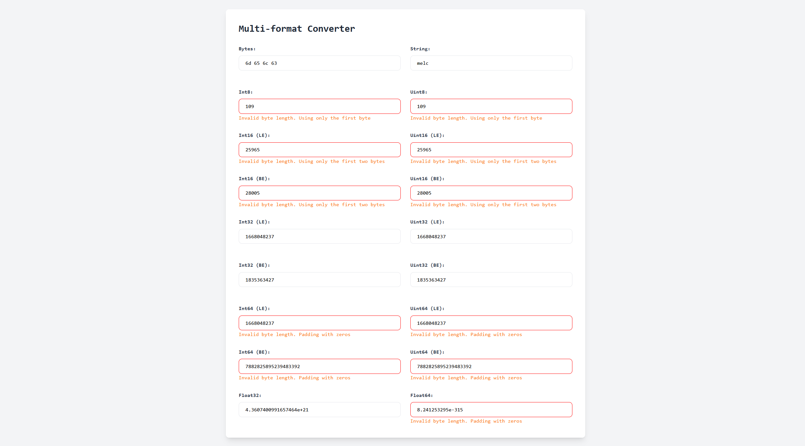

# Bytes converter

[](https://tools.hiumee.com/converter)

This is a converter to transform integers, floats, and strings to bytes and vice versa.

## Usage

You can use the website hosted on github pages [https://tools.hiumee.com/converter](https://tools.hiumee.com/converter).

## Self-hosting

Clone the repository and start a web server in the root directory. For example, using python:

```bash
python3 -m http.server
```

Then open your browser and go to `http://localhost:8000`.

## Use the PWA

You can also install the web app as a PWA. This will allow you to use the app offline. To do this, open the website and click on the install button in the address bar.

# Development

For development, you can use the same setup, with the addition of compiling the tailwindcss stylesheets. You can do this by running:

```bash
npm install
npx tailwindcss -i ./input.css -o ./style.css
```

# Tools used

- [Tailwindcss](https://tailwindcss.com/) - Stylesheets
